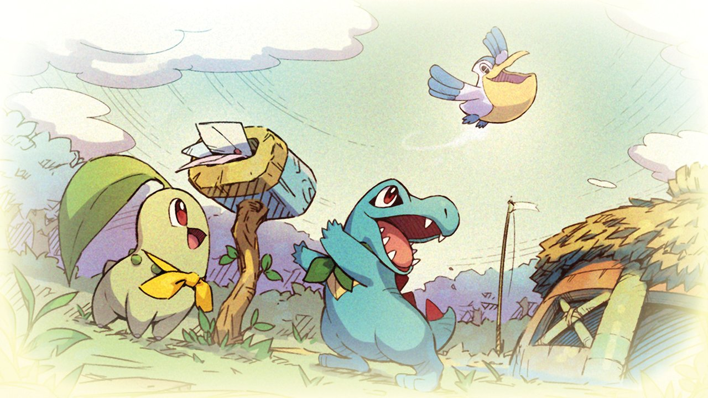
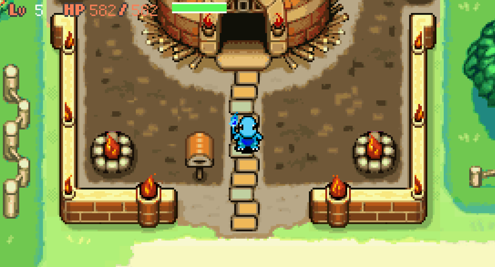
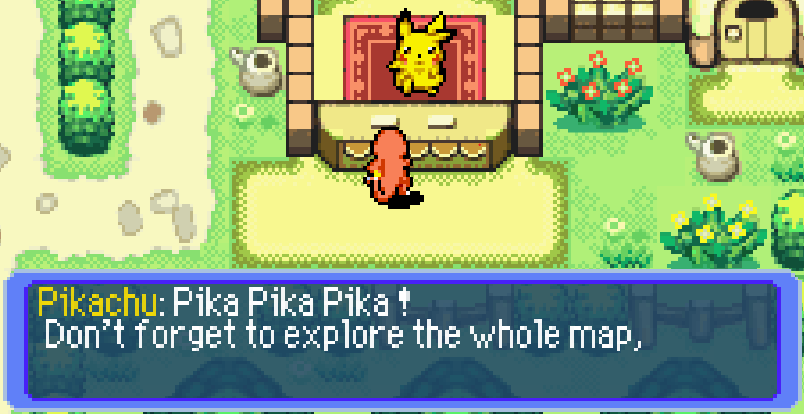
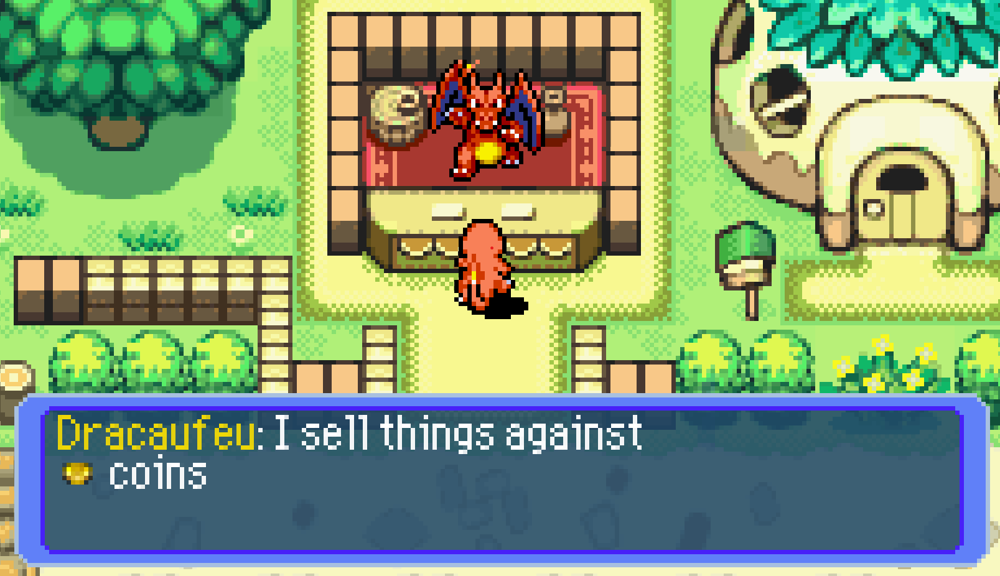

<p align="center">
  
</p>

---

<div align="center">

  <a href="https://www.python.org/"></a>
  <a href="https://fr.wikipedia.org/wiki/C_(langage)"></a>

<div>
    <span>End Of First Year Project</span>
</div>
</div>

## 📋 Table of Contents
* [📖 What's the goal of this project](#about)
* [🛠️ Building and launching](#building)
* [🚀 Features](#features)
    * [Scene Building](#scene)
    * [UI Building](#ui)
    * [Multiplayer](#multiplayer)
    * [Memory Management](#memory)

## Building

### Requirements

To be able to build this project you will only need a proper Linux/Unix/Windows environment and the CMake tool installed. Everything else is bundled by the ```CMakeLists.txt``` file using the ```FetchContent``` utilities. 

### Building

To build the project you will need to follow these steps:

```bash

git clone https://github.com/QuentinBriand/MysteryDungeon.git

# In the project directory
cmake . -B build/
cmake --build build

# To launch the game
./build/bin/Debug/MyRpg.exe
```

### Launching the game

You can launch the game by clicking on the executable in the ```build/bin/Debug``` folder. But you can also launch it using the terminal:

```bash
./build/bin/Debug/MyRpg.exe -h
```
It will display the help message and the different flags you can use to launch the game. There's debug flags, some that sets values but also flags to launch the game in multiplayer mode.

> [!NOTE]  
> You could play the game with your keyboard or with a controller. Even if the keybinds mapping will only work for keyboards.

## 📖 What's the goal of this project

This project is one of the freest project from my first year at Epitech. The main challenge of this project is to have a complete game using everything that me and my team know and it has to follow classical RPG rules like having an inventory, having a basic fighting system or having a menu for example.

This project is originally made with a team of 4, but since we had another project at the same time and we had a teammate that essentially did nothing. We were a team of 2 for this 3 weeks project. This readme will only showcase the bonuses we had.

## 🚫 Authorized Functions

- From the CSFML library:
    - Every functions and macros
- From the math C library:
    - Every functions and macros
- From the standard C library:

|   |   |   |
|---|---|---|
| __free__ | __(f)open__ | __opendir__ |
| __memset__ | __(f)read__ | __readdir__ |
| __(s)rand__ | __(f)close__ | __closedir__ |

> [!CAUTION]
> Any unspecified functions are de facto banned, except for bonus features.

## 🚀 Features

### Scene

A scene is defined by it's ID defined in the ```enum scenes_e``` defined in ```rpg.h```. We can find the scenes ```HOME, VILLAGE, INTERIOR, DOJO, BEKIPAN, DITTOLAND, BOSS, MAIN_MENU, INTRO, DITTO, DREAM, DUNGEON and QUIZ```

<p align="center">
  
</p>

But we need to fill this scene with decorations, for this we have the ```atlas.png```. And since it contains all sprites of the game we can refer to the ```statics.csv``` it defines every static animations. It follows the pattern: ```Name;Left;Top;Width;Height;Max x;Loop Type```, with Loop Type being either 0 or 1 (Linear or cyclic).

For the ```HOME``` scene we have another step to do. This scene has different houses depending on the pokemon played, for this we refer to another csv ```house.csv```.

Both ```house.csv``` and ```scenes.csv``` follows the same pattern of having ```Static Name; X Coord; Y Coord;``` over and over. Knowing that for a scene with ID x you only parse the xth line of the csv's.

### UI

Since we have to use only the CSFML library we had to create our own superset library. It's composed of 2 main parts:

#### The blocks around the text

<p align="center">
    
</p>

As showcase in the image above, we can see the blocks around the text. It's a simple rectangle with a border and a background color. But to be able to use it as a rectangle of any size we had to isolate the corners and the borders. A texture is then generated with the corners, next the borders are expanded to the size of the rectangle and lastly the background is filled.

#### The text formatting

<p align="center">
    
</p>

The image above clearly illustrate our biggest challenge. Natively the SFML class doesn't have the ability to have a text with different colors, text wrapping and lastly having a mix of texts and icons. To be able to have this we had to create our superset library that would have all of these features. First we established a simple format for the text following a pattern similar to html:
    
    <239 216 7>Dracaufeu</c>: I sell things against \n <i_lCoin> coins \n 
    <239 216 7>Dracaufeu</c>: Don't hesitate to spend all your \n money ! \n

Any three numbers between ```<``` and ```>``` will color all the text behind as ```<R B G>```, this color can be quickly reset to white with ```<c>```. The ```<i_``` and ```>``` will be used to display an icon. The icon is a simple sprite defined in the ```icons.csv``` file, following the pattern: ```Icon Name;Left;Top;Width;Height;```. Lastly the ```\n``` will be used to wrap the text. in the block.

All dialogs can be found in the ```dialogs``` folder in files ending with ```.dialog```. Each line in the file is a "block", the player will have to press the interact key to either stop the typing animation of the current block or go to the next block.

### Multiplayer

The multiplayer was implemented as a quick and dirty bonus. It has a client/host architecture with the host being the one that has the game and the client that connects to his game. The client can only move his character, interact with the NPC's and change his scene (by just moving). It works by sending a packet with different "orders" to the host. Both client and host will have their game and the order are just made to be able to sync the game.

The different orders can be found in the ```enum order_e``` defined in ```rpg.h```. We can find the orders:
- ```OKAY```
- ```CONNECTION```,
- ```CSYNC```,
- ```POSITION```,
- ```CHANGE_SCENE```,
- ```HSYNC```,
- ```SETPOS```,
- ```DUNGEONSYNC```

### Memory

We had a very basic of automatic memory management. We had to type of memory allocations:
- The ```sf{Class}_create``` and ```sf{Class}_destroy``` functions that would allocate and free any SFML related objects.
- And the ```malloc``` and ```free``` functions that would allocate and free any other objects.

Both have the same logic, to create a new object we would either use ```my_malloc``` or ```my_sfalloc(construction_fx, destruction_fx)```. This would call the corresponding function, but it will also store the void* pointer in a static singly linked list. This list is used to free all the objects at the end of the game. This is done by calling ```my_malloc``` or ```my_sfalloc``` with a ```NULL``` parameter.